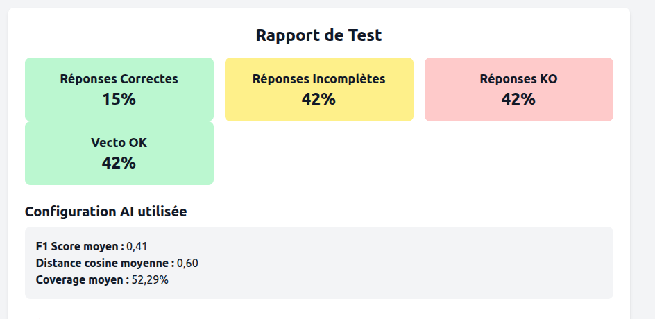
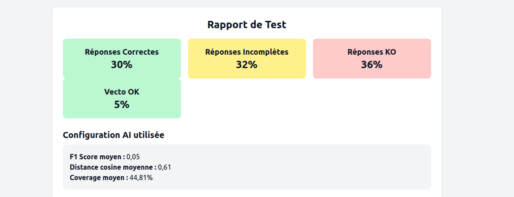

# Étude Comparative – SPIKE
**Docling vs Marker PDF pour l’extraction OCR dans un système RAG**  
*Projet IA Générative – Isia*

## 🎯 Objectif du SPIKE

L’objectif de cette étude est de comparer deux bibliothèques de traitement de documents OCR — **Docling** et **Marker PDF** — afin d’évaluer leur pertinence pour une utilisation dans un système RAG (Retrieval-Augmented Generation), dans le cadre d’un projet d’IA générative appliquée à la documentation technique.

---

## Contexte et Méthodologie

- **Base de test** : 7 documents techniques PDF (originaux Polytropic)
- **Critères d’analyse** :
    - Précision de l’OCR (textuelle et structurelle)
    - Facilité d’intégration dans le pipeline RAG
    - Qualité des *chunks* générés pour l’indexation vectorielle
    - Contrôle de la structuration (titres, paragraphes, sections)
    - Maîtrise des données
- **Méthodologie** :
    - Extraction des documents via chaque outil
    - vectorisation des résultats
    - Évaluation qualitative via visualiseur Angular OCR
    - Tests qualité

---

## 📌 Résultats & Analyse

### Docling

| Critère                        | Résultat                                                                                  |
|--------------------------------|-------------------------------------------------------------------------------------------|
| **Qualité OCR brute**          | Moyenne dans l’ensemble, nécessite un contrôle rgoureux et des corrections manuelles      |
| **Structuration des contenus** | Moyenne : typage pas toujours précis, très dépendant de la qualité des documents entrants |
| **Chunks pour le RAG**         | Faible: paragraphes mal découpés et rendus                                                |
| **Facilité d’intégration**     | Bonne: implémentation facile, très faible temps d'exécution, utilises peu de ressources   |
| **Maîtrise des données**       | Parfaite: Les données ne sont pas exportées vers des services tiers                       |

> Le système Docling fonctionne, s'intègre facilement, mais offre peu garanties sur la qualité brute de l'extraction, nécessite du contrôle et un travail de correction important pour avoir une qualité 

---

### Marker PDF

| Critère                       | Résultat                                                                                                                 |
|-------------------------------|--------------------------------------------------------------------------------------------------------------------------|
| **Qualité OCR brute**         | Très bonne, presque pas besoin de repasser à la main                                                                     |
| **Structuration des contenus**| Bonne : logique resoectée, détection très bonne des structures logiques d'un document, même avec des documents complexes |
| **Chunks pour le RAG**        | Bons: paragraphes respectés, à contrôler pour des documents complexes                                                    |
| **Facilité d’intégration**    | Mauvaise : temps d'exécution élevé, utilises plus de resources                                                        |
| **Maîtrise des données**       | Parfaite: Les données ne sont pas exportées vers des services tiers                                                      |
> Marker PDF permet une meilleure qualité d'extraction documentaire. Il consomme cependant d'avantage de resources et demande plus de temps (compter une quinzaine de minutes pour un document du jeu de test contre quelques secondes pour Docling) mais pour une qualité supérieure.

---

## 📊 Expérimentations menées

###  test du chunking brut de chaque librairie
- Objectif : mesurer la qualité brut des deux solutions

## Résultats

| Test | Moteur OCR     | Chunking          | score tests qualité |
|------|----------------|-------------------|---------------------|
| 1    | Docling        | Par défaut        | 15/42/42            |
| 2    | Marker PDF     | Par défaut  | 30/32/36            |

---

## Conclusion

- **Docling** est une bonne base, rapide, facile à intégrer
- **Marker PDF** offre une OCR plus robuste, un découpage mieux contrôlé mais nécessite plus de ressource serveur

---

## Recommandation

Adopter **Marker PDF** comme moteur OCR principal dans le projet :

Argument principale : on gagne du temps et de la qualité, de façon indéniable, sur la lecture documentaire, car ce qu'on perd sur le temps d'exécution est rattrapé par le temps qu'on doit passer à corriger l'extraction de Docling

Point faible : demande à faire un test de dispo de l'application lorsque que l'on va charger des documents en situation réelle (machines équivalent prod, donc pas valable en recette)

## Annexes

En-têtes rapports de tests qualités effectués : 

- Docling:
 

- Marker-pdf (rapport à refaire):

