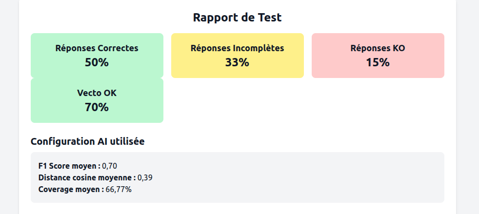
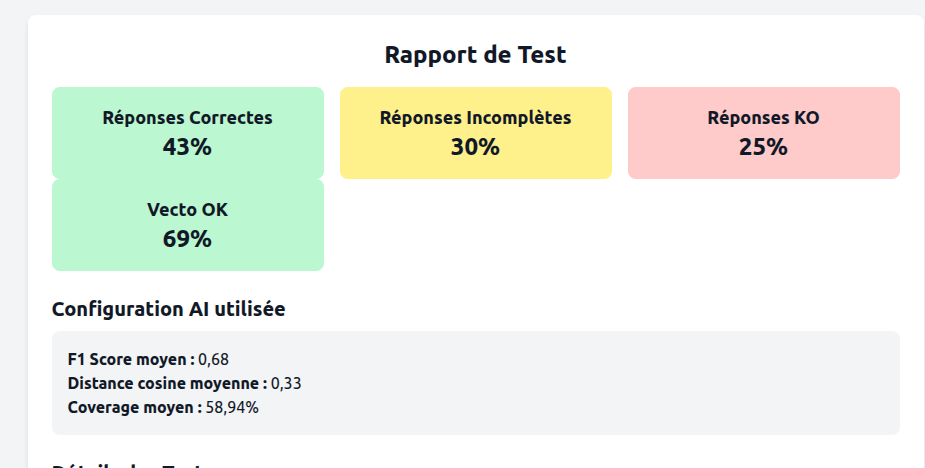

# Isia - Decision

## Semaine 30 du 21/07/2025

- Avancées sur le POC => il est devenu utilisable 

- gros travail de vérification de la qualité de l'OCR isation, sur les documents du jeu de test initial (les 7 documents originaus Polytropic), grâce à l'outil. Une fois les données harmonisées,  

- Meilleure compréhension de nos résultats, on a des pattern clairs.
- on a pu remarquer aussi que, grosso modo, le LLM actuel, si on lui fournit la bonne information dans le contexte, il nous donnera la bonne réponse. Les mauvaises réponses qu'on obtient désormais sont dues aux défaillance du système de RAG

(extrait rapport ultime ultime)

[rapport-ultime-ultime.html](./rapport-ultime-ultime.html)

- Conclusion de la semaine : on est solide sur nos bases avec ce nouveau système d'OCR on est capable de savoir très excatement les problèmes de qualité qu'on, à quoi ils sont dues

- idée pour contrer ce résidus de mauvaises réponses : chunker phrase par phrase ou ligne par ligne et RAGger dessus pour voir si on a un des réponses contenues dans une phrases qui sont noyées dans la "masse" d'un paragraphe

## Semaine 31 du 28/07/2025

- premier test : pas très concluant, dans certains cas, on remonte juste une phrase alors qu'il faudrait remonterle paragraphe et inversement

[rapport-chunks-phrases.html](./rapport-chunks-phrases.html)

Reflexion sur l'integration de golden queries
Reflexion de l'intégration d'un lexique
